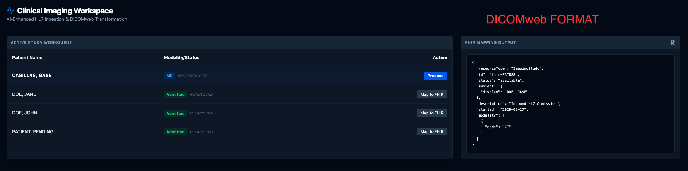

🚀 Overview
This project is a Full-Cycle Interoperability Engine designed to demonstrate the modernization of clinical data workflows. It ingests legacy healthcare data formats (HL7 v2 and DICOM) and transforms them into a unified, FHIR-compliant (Fast Healthcare Interoperability Resources) ecosystem for real-time clinical decision support.

# Clinical Imaging Interoperability Engine

## 📺 System Demonstration

## 🛠 Features
* **HL7 v2 Ingestion**: Real-time patient admission via terminal.
* **DICOM to FHIR**: Automated mapping of legacy imaging tags.
* **AI Diagnostic Viewer**: Interactive brain MRI with toggleable SEG overlays.

## 🖼 Dashboard Preview
(./public/DICOM2.png)

## 📄 Project Documentation
[Download the Project Brief (PDF)](./DICOM%20Integration%20(1).pdf)

🛠 Real-World Architecture & Connections
1. Legacy HL7 v2 Ingestion (The Hospital Feed)
The Connection: Simulates an Admission, Discharge, and Transfer (ADT) feed from an EMR.

Technical Implementation: A custom Node.js API Route handles inbound raw HL7 messages via curl. It parses segments like the MSH (Message Header) and PID (Patient Identification) to register new patients in the system.

2. DICOMweb Metadata Transformation (The Imaging Bridge)
The Connection: Demonstrates the shift from legacy "Hex-Tag" DICOM (PS3.18) to modern DICOMweb JSON.

Technical Implementation: Maps raw 16-bit hex tags (e.g., 0010,0010 for Patient Name) into structured FHIR ImagingStudy resources. This allows imaging metadata to be searchable and accessible by modern web applications.

3. Real-Time Cloud Synchronization (The Clinical Brain)
The Connection: Centralizes fragmented hospital data into a single source of truth.

Technical Implementation: Uses Firebase Firestore as a real-time database. When an HL7 message is received, the frontend dashboard updates instantly via onSnapshot listeners, mirroring the real-time nature of a hospital workqueue.

4. AI-Enhanced Clinical Decision Support (The Future)
The Connection: Bridges the gap between Computer Vision (AI) and the physician's EMR interface.

Technical Implementation: Features a simulated AI Logic Controller that scans DICOM metadata. For specific cases (e.g., "CASILLAS, GABE"), it triggers a Critical Machine Vision Alert for an "Acute Intracranial Hemorrhage," providing a confidence score and a link to the DICOM Segmentation (SEG) object.

💻 Tech Stack
Frontend: Next.js 14, Tailwind CSS, Lucide-React

Backend: Next.js API Routes (TypeScript)

Database: Google Firebase Firestore

Healthcare Libraries: node-hl7-client

Standards: HL7 v2, DICOM PS3.18, FHIR R4

📈 Demo Instructions
Ingest Patient: Run the curl command to send a DOE, JOHN or DOE, JANE admission via HL7.

Verify Workqueue: Watch the patient appear instantly in the "Active Study Workqueue."

Process Imaging: Click "Process" (for Gabe) or "Map to FHIR" (for John/Jane).

Full Circle EMR: View the final, unified patient record in the "Enterprise EMR Portal," complete with AI anomaly detection for the Casillas study.